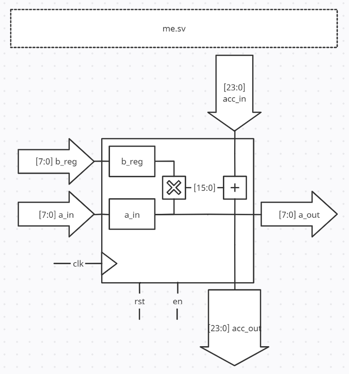

# 8x8 Systolic Matrix Multiplier
This project implements a weight-stationary systolic array matrix multiplier in SystemVerilog, hopefully one that can interface with my upcoming RISC-V CPU core project. And eventually run a forward pass of a simple fully-connected network on an image from the MNIST data set.

There are a several Verilog files that have been compiled and simulated with Xilinx Vivado, half these boilerplate/workspace config files have been eliminated but some may be essential to reproduce this, I guess we will find out later! All sources are located in, <code>/mpu_project.srcs/</code>. Some of them are described lower in the README.

 

### Matrix Unit (ME) <code>me.sv</code>

This is one slice of a ME from the entire array, the entire array features 64 modules, with only 16 ever performing I/O outside the array networks.

- <code>a_in</code> takes an 8-bit input from the previous ME or input network, and multiplies it by <code>b_reg</code>, and then adds it to <code>acc_in</code>. After this chain of operations the result flow must be 24 bits wide to accommodate the chaining of matrix sums from previous ME's after 8 MAC operations.

- <code>a_out</code> outputs <code>a_in</code> on the next clock cycle allowing the data to flow to the next ME. While <code>acc_out</code> sends the partial sum calculated to the ME below and continues the chain.

 

## Neural Network Execution
Also included in the repository is, <code>matrix_multiply.py</code> which implements a forward pass of a simple network made up of: a flatten input operation, hidden layer, and softmax output classifier. The network is trained externally on MNIST using TF Keras and the weights are exported as matrices (.npy).

This part is currently WIP and DOES NOT run.

